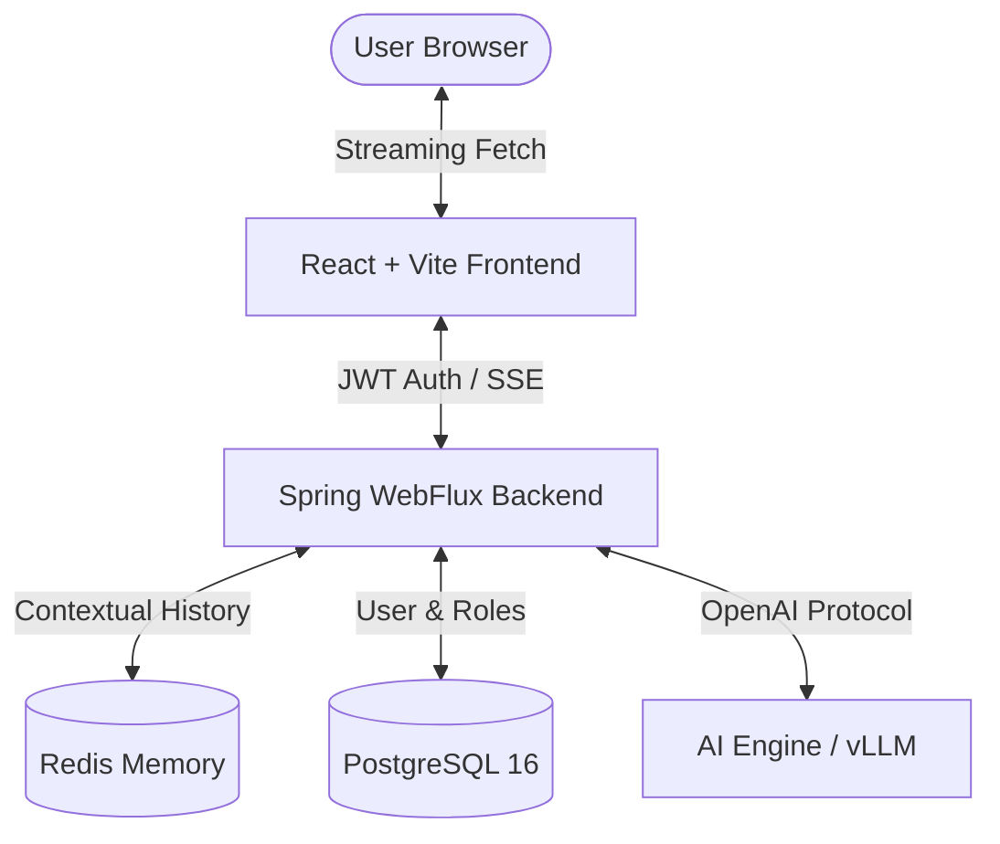

# GenOps AI Platform 🚀 – Enterprise Full-Stack GenAI Orchestration

GenOps AI is a production-grade Generative AI engineering platform designed for scalable, context-aware AI interactions. It features a modern React frontend, a reactive Spring Boot backend, and a robust data layer leveraging Redis for memory and PostgreSQL for identity management.

---

## 🏗️ System Architecture

The platform follows a modern microservices-ready architecture, fully containerized with Docker:



---

## 🌟 Key Features

- **⚡ Streaming Inference**: Real-time token streaming using WebFlux SSE and Fetch API for a ChatGPT-like experience.
- **🧠 Contextual Memory**: Redis-backed sliding window conversation history (remembers last 10 messages).
- **🔐 Enterprise Security**: 
  - Stateless JWT Authentication.
  - Social Identity integration (Google & GitHub OAuth2).
  - Role-based Access Control (RBAC).
- **🎨 Premium UI/UX**: Dark-themed glassmorphism design with Tailwind CSS v4 and Framer Motion.
- **🐳 DevOps Ready**: Fully orchestrated multi-container deployment using Docker Compose.

---

## 🛠️ Tech Stack

- **Frontend**: React 19, Vite, Tailwind CSS v4, Framer Motion, Axios, React Router 7.
- **Backend**: Java 21, Spring Boot 3.2, Spring WebFlux, Spring Security 6.
- **Database**: PostgreSQL 16 (User Accounts), Redis 7 (Chat Memory).
- **Infrastructure**: Docker, Docker Compose, Maven.

---

## 🚀 Quick Start

### 1. Prerequisites
- Docker & Docker Compose installed.
- (Optional) Google/GitHub OAuth2 credentials.

### 2. Launch the Platform
Clone the repository and run:
```bash
docker-compose up -d --build
```

### 3. Access
- **Frontend**: [http://localhost:5173](http://localhost:5173)
- **Backend API**: [http://localhost:8081](http://localhost:8081)

---

## 🔐 Configuration

Update `genops-ai-backend/src/main/resources/application.yml` for custom settings:

```yaml
jwt:
  secret: ${JWT_SECRET}
  expiration: 86400000 # 24 hours

ai:
  memory:
    max-messages: 10
    ttl-hours: 24
```

---

## 📁 Project Structure

```text
genops-ai/
├── genops-ai-frontend/    # React + Vite Application
├── genops-ai-backend/     # Spring Boot WebFlux Service
├── docker-compose.yml     # Full-stack Orchestration
└── .dockerignore          # Build Optimizations
```

---

## 🤝 Contributing
Contributions are welcome! Please feel free to submit a Pull Request.

---

**Developed by [01Sachinc](https://github.com/01Sachinc)**
