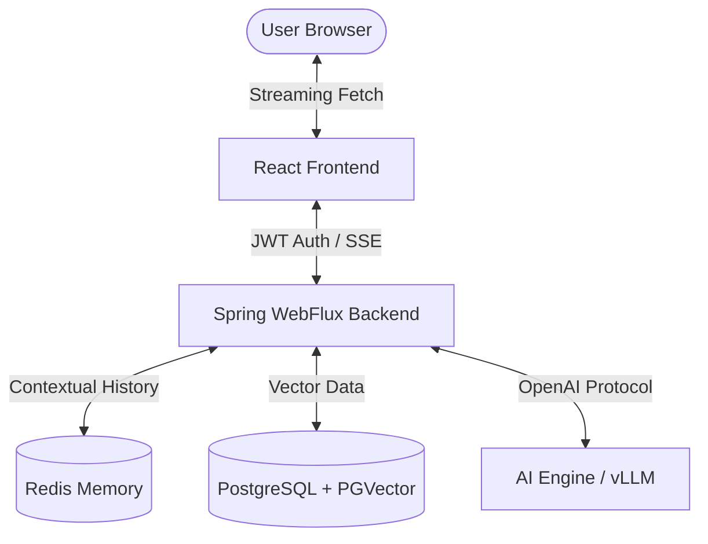

# GenOps AI Platform
[](https://opensource.org/licenses/MIT)
[](https://spring.io/projects/spring-boot)
[](https://react.dev/)
[](https://kubernetes.io/)
[](https://github.com/features/actions)

**GenOps AI Platform** is an enterprise-grade, cloud-native AI infrastructure platform. It provides a high-performance streaming interface for AI inference, integrated RAG (Retrieval-Augmented Generation) pipelines, and robust observability, all designed for production scale.

---

## 📖 Table of Contents
- [Features](#-features)
- [Architecture Overview](#-architecture-overview)
- [RAG Pipeline](#-rag-pipeline)
- [CI/CD & DevOps](#-cicd--devops)
- [Docker Setup](#-docker-setup)
- [Kubernetes Deployment](#-kubernetes-deployment)
- [Monitoring & Observability](#-monitoring--observability)
- [Security](#-security)

---

## 🌟 Features

- **⚡ Real-time Token Streaming**: ChatGPT-like experience using SSE (Server-Sent Events) and WebFlux.
- **📚 Integrated RAG Pipeline**: PDF upload, Apache Tika parsing, and semantic search using **PGVector**.
- **🧠 Contextual Redis Memory**: Intelligent conversation history with sliding-window support.
- **⚙️ Enterprise CI/CD**: Dual support for **Jenkinsfiles** and **GitHub Actions** with Trivy security scanning.
- **☸️ Cloud-Native K8S**: Full manifests with HPA, readiness/liveness probes, and Ingress.
- **📈 Full Observability**: Prometheus & Grafana stack for monitoring AI performance.
- **🔐 DevSecOps Ready**: Automated vulnerability scanning and secure secret management.

---

## 🏗️ Architecture Overview



---

## 📚 RAG Pipeline

The platform supports advanced **Retrieval-Augmented Generation**:
1. **Upload**: Users upload technical PDFs via the UI.
2. **Parsing**: Apache Tika extracts text in the backend.
3. **Vectorization**: Spring AI generates embeddings using HuggingFace models.
4. **Storage**: Vectors are stored in a **PGVector** database for high-performance similarity search.
5. **Inference**: User queries are augmented with relevant context snippets before being sent to the LLM.

---

## ⚙️ CI/CD & DevOps

### GitHub Actions
- `build.yml`: Builds backend/frontend and pushes to Docker Hub.
- `security.yml`: Runs daily **Trivy** scans on container images.

### Jenkins
- `Jenkinsfile`: Multistage pipeline with environment selection (`dev`, `staging`, `prod`), security scanning, and automated K8s deployment.

---

## 🐳 Docker Setup

### Quick Start
1. Configure `.env`:
   ```bash
   cp .env.example .env
   ```
2. Launch the platform:
   ```bash
   docker-compose up -d --build
   ```
3. Access:
   - **Frontend**: [http://localhost:5173](http://localhost:5173)
   - **Prometheus**: [http://localhost:9090](http://localhost:9090)
   - **Grafana**: [http://localhost:3000](http://localhost:3000)

---

## ☸️ Kubernetes Deployment

Unified deployment using shell scripts:
```bash
./scripts/deploy.sh k8s
```

### Manifests included:
- `backend.yaml`: Deployment + Service + HPA
- `postgres-pgvector.yaml`: StatefulSet + Service
- `redis.yaml`: Deployment + Service
- `ingress.yaml`: Nginx Ingress rules
- `namespace.yaml`: Enterprise namespace isolation

---

## 👨‍💻 Developer Information

**Sachin**  
*Senior DevSecOps Engineer*  
📧 [cssachin83@gmail.com](mailto:cssachin83@gmail.com)  
🔗 [LinkedIn Profile](https://www.linkedin.com/in/01sachinc/)

---

## ⚖️ License
MIT License. See [LICENSE](LICENSE) for details.
