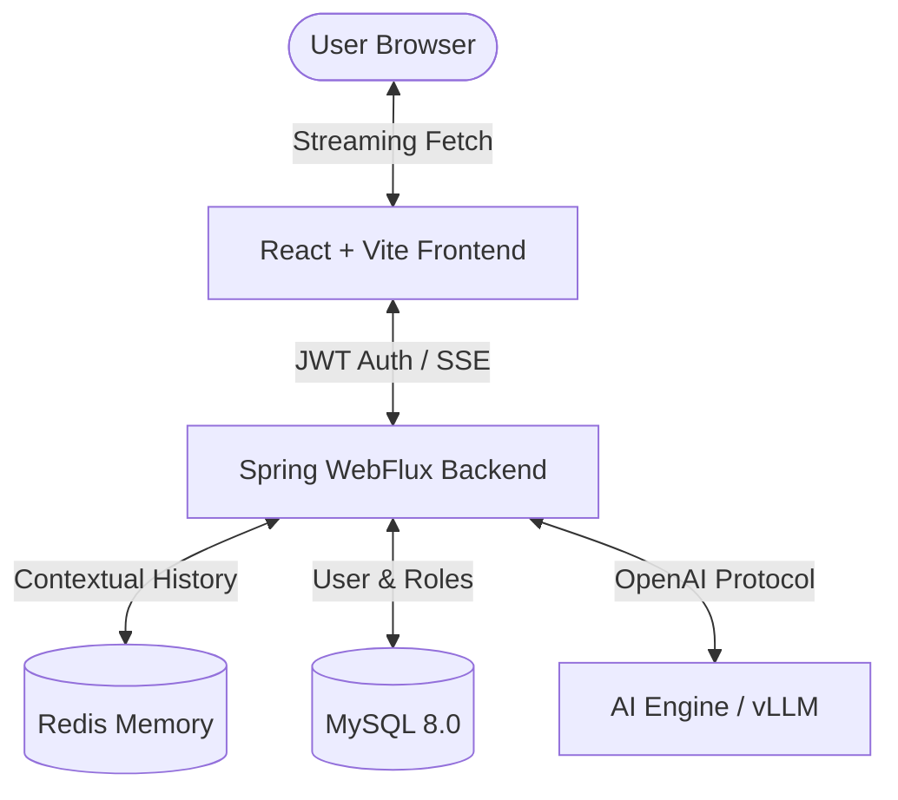
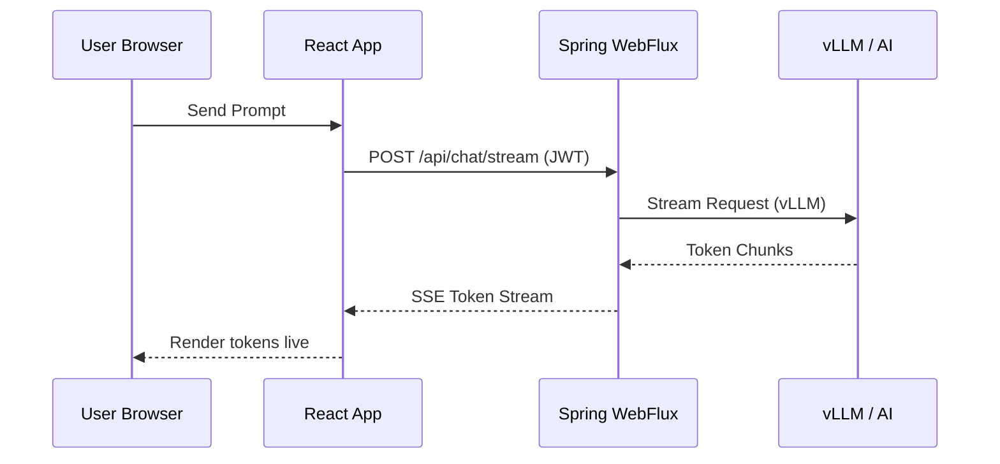
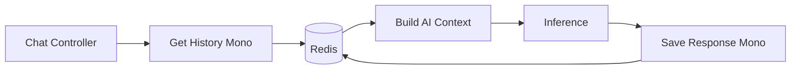

# GenOps AI Platform 🚀
[](https://opensource.org/licenses/MIT)
[](https://spring.io/projects/spring-boot)
[](https://react.dev/)
[](https://tailwindcss.com/)
[](https://www.docker.com/)

**GenOps AI Platform** is a production-grade, enterprise-scale Generative AI engineering platform. It provides a high-performance streaming interface for AI inference, backed by a reactive microservices architecture, persistent conversation memory, and robust security.

---

## 📖 Table of Contents
- [Features](#-features)
- [Architecture Overview](#-architecture-overview)
- [Streaming Architecture](#-streaming-architecture)
- [Tech Stack](#-tech-stack)
- [Docker Setup](#-docker-setup)
- [Kubernetes Deployment](#-kubernetes-deployment)
- [API Documentation](#-api-documentation)
- [Security](#-security)
- [Monitoring](#-monitoring)
- [Developer Info](#-developer-info)

---

## 🌟 Features

- **⚡ Real-time Token Streaming**: ChatGPT-like experience using SSE (Server-Sent Events) and Fetch Streams.
- **🧠 Contextual Redis Memory**: Intelligent sliding-window conversation history (last 10 turns).
- **🔐 Enterprise Security**: Stateless JWT-based authentication with Social Login (OAuth2) readiness.
- **🎨 Premium UI/UX**: Dark-themed glassmorphism design with Tailwind CSS v4 and Framer Motion animations.
- **🐳 DevOps First**: Fully containerized with Docker and ready for Kubernetes orchestration.
- **📈 Observability**: Correlation IDs and structured logging for request tracing.

---

## 🏗️ Architecture Overview



---

## ⚡ Streaming Flow



---

## 🧠 Redis Conversation Memory



---

## 🛠️ Tech Stack

### Frontend
- **Framework**: React 19 (Vite)
- **Styling**: Tailwind CSS v4, Framer Motion
- **Networking**: Axios (Auth), Fetch API (Streaming)
- **Rendering**: React Markdown, Syntax Highlighter

### Backend
- **Framework**: Spring Boot 3.2 (Java 21)
- **Engine**: Spring WebFlux (Reactive)
- **Security**: Spring Security 6 (JWT + OAuth2)
- **Persistence**: Spring Data JPA (MySQL), Reactive Redis

### AI & Infrastructure
- **AI Inference**: vLLM (OpenAI Compatible)
- **Databases**: MySQL 8.0, Redis 7
- **Orchestration**: Docker Compose, Kubernetes

---

## 🐳 Docker Setup

### Prerequisites
- Docker & Docker Compose installed.

### Quick Start
1. Clone the repository:
   ```bash
   git clone https://github.com/01Sachinc/GenOps-AI.git
   cd GenOps-AI
   ```
2. Configure `.env`:
   ```bash
   cp .env.example .env
   ```
3. Launch the platform:
   ```bash
   docker-compose up -d --build
   ```
4. Access:
   - **Frontend**: [http://localhost:5173](http://localhost:5173)
   - **Backend API**: [http://localhost:8081](http://localhost:8081)

---

## ☸️ Kubernetes Deployment

### Deployment Steps
1. Create Namespace:
   ```bash
   kubectl apply -f k8s/namespace.yaml
   ```
2. Apply Config & Secrets:
   ```bash
   kubectl apply -f k8s/config/
   ```
3. Deploy Infrastructure:
   ```bash
   kubectl apply -f k8s/postgres/
   kubectl apply -f k8s/redis/
   ```
4. Deploy App:
   ```bash
   kubectl apply -f k8s/backend/
   kubectl apply -f k8s/frontend/
   ```

---

## 🔐 Security Architecture

- **JWT Flow**: HMAC-SHA256 signing for stateless auth.
- **Social Login**: OAuth2 Success Handlers for Google/GitHub.
- **CORS**: Secure cross-origin resource sharing policy.
- **Hashing**: BCrypt for local password storage.

---

## 📈 Monitoring Stack

- **Prometheus**: Scraping Actuator endpoints.
- **Grafana**: Visualizing token latency and memory usage.
- **Loki**: Log aggregation for distributed tracing.

---

## 📂 Folder Structure

```text
genops-ai-platform/
├── frontend/          # React + Vite + Tailwind
├── backend/           # Spring Boot WebFlux
├── docker/            # Nginx & Environment configs
├── k8s/               # Kubernetes Manifests
├── jenkins/           # CI/CD Pipeline scripts
├── monitoring/        # Prometheus & Grafana configs
├── docs/              # Detailed Documentation
├── .github/           # GitHub Actions Workflows
└── docker-compose.yml # Local Development Orchestration
```

---

## 👨‍💻 Developer Information

**Sachin**  
*Senior DevSecOps Engineer*  
📧 [cssachin83@gmail.com](mailto:cssachin83@gmail.com)  
📞 +91 8496001030  
🔗 [LinkedIn Profile](https://www.linkedin.com/in/01sachinc/)

---

## ⚖️ License
This project is licensed under the MIT License - see the [LICENSE](LICENSE) file for details.
